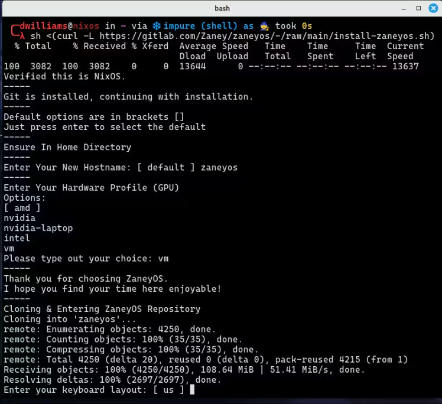
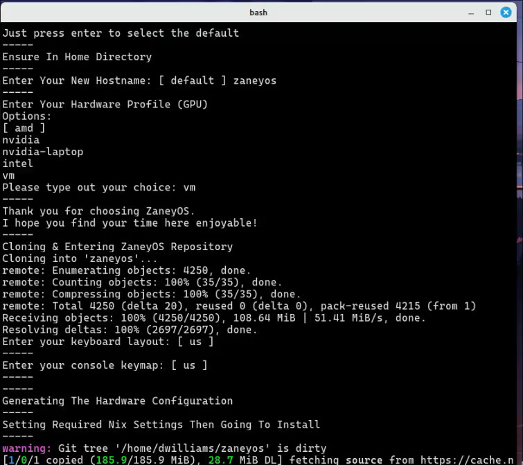
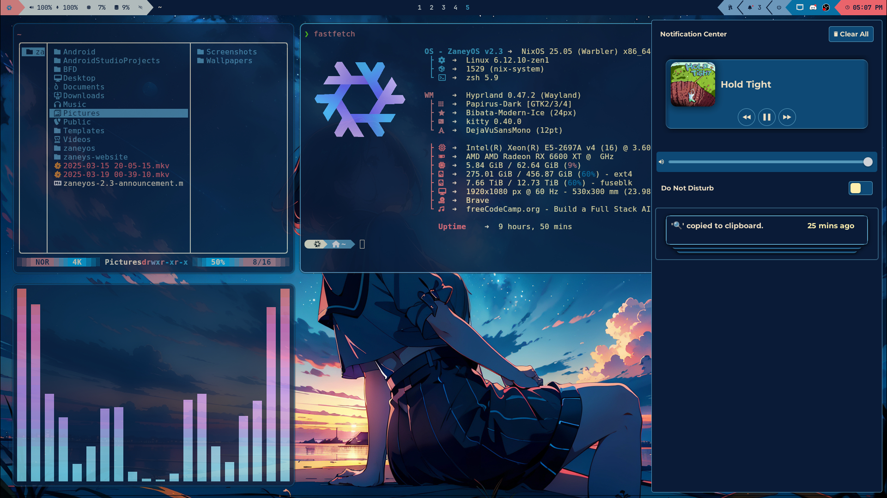

<div align="center">

# Hyprland Keybindings

Below are the keybindings for Hyprland, formatted for easy reference.

## Application Launching

- `$modifier + Return` → Launch `terminal`
- `$modifier + K` → List keybinds
- `$modifier + Shift + Return` → Launch `rofi-launcher`
- `$modifier + Shift + W` → Open `web-search`
- `$modifier + Alt + W` → Open `wallsetter`
- `$modifier + Shift + N` → Run `swaync-client -rs`
- `$modifier + W` → Launch `Web Browser`
- `$modifier + Y` → Open `kitty` with `yazi`
- `$modifier + E` → Open `emopicker9000`
- `$modifier + S` → Take a screenshot
- `$modifier + D` → Open `Discord`
- `$modifier + O` → Launch `OBS Studio`
- `$modifier + C` → Run `hyprpicker -a`
- `$modifier + G` → Open `GIMP`
- `$modifier + V` → Show clipboard history via `cliphist`
- `$modifier + T` → Toggle terminal with `pypr`
- `$modifier + M` → Open `pavucontrol`

## Window Management

- `$modifier + Q` → Kill active window
- `$modifier + P` → Toggle pseudo tiling
- `$modifier + Shift + I` → Toggle split mode
- `$modifier + F` → Toggle fullscreen
- `$modifier + Shift + F` → Toggle floating mode
- `$modifier + Alt + F` → Float all windows
- `$modifier + Shift + C` → Exit Hyprland

## Window Movement

- `$modifier + Shift + ← / → / ↑ / ↓` → Move window left/right/up/down
- `$modifier + Shift + H / L / K / J` → Move window left/right/up/down
- `$modifier + Alt + ← / → / ↑ / ↓` → Swap window left/right/up/down
- `$modifier + Alt + 43 / 46 / 45 / 44` → Swap window left/right/up/down

## Focus Movement

- `$modifier + ← / → / ↑ / ↓` → Move focus left/right/up/down
- `$modifier + H / L / K / J` → Move focus left/right/up/down

## Workspaces

- `$modifier + 1-10` → Switch to workspace 1-10
- `$modifier + Shift + Space` → Move window to special workspace
- `$modifier + Space` → Toggle special workspace
- `$modifier + Shift + 1-10` → Move window to workspace 1-10
- `$modifier + Control + → / ←` → Switch workspace forward/backward

## Window Cycling

- `Alt + Tab` → Cycle to next window
- `Alt + Tab` → Bring active window to top

## Installation:

<details>
<summary><strong> ⬇️ Install with script </strong></summary>

### 📜 Script:

This is the easiest and recommended way of starting out. The script is not meant
to allow you to change every option that you can in the flake or help you
install extra packages. It is simply here so you can get my configuration
installed with as little chances of breakages and then fiddle to your hearts
content!

Simply copy this and run it:


```
nix-shell -p git curl
```

Then:


```
sh <(curl -L https://gitlab.com/Zaney/zaneyos/-/raw/stable-2.3/install-zaneyos.sh)
```

#### The install process will look something like this:





#### After the install completes your environment will probably look broken. Just reboot and you will see this as your login:


#### Then after login you should see a screen like this:



</details>

<details>
<summary><strong> 🦽 Manual install process:  </strong></summary>

1. Run this command to ensure Git & Vim are installed:

```
nix-shell -p git vim
```

2. Clone this repo & enter it:

```
cd && git clone https://gitlab.com/zaney/zaneyos.git -b stable-23 ~/zaneyos 
cd zaneyos

You can still run the `install.sh` script if you want to.
```

- _You should stay in this folder for the rest of the install_

3. Create the host folder for your machine(s) like so:

```
cp -r hosts/default hosts/<your-desired-hostname>
```

4. Edit `hosts/<your-desired-hostname>/variables.nix`.

5. Edit `flake.nix` and fill in your username, profile, and hostname.

6. Generate your hardware.nix like so:

```
nixos-generate-config --show-hardware-config > hosts/<your-desired-hostname>/hardware.nix
```

7. Run this to enable flakes and install the flake replacing hostname with
   profile. I.e. `intel`, `nvidia` `nvidia-laptop`, or `vm`

```
NIX_CONFIG="experimental-features = nix-command flakes" 
sudo nixos-rebuild switch --flake .#profile
```

Now when you want to rebuild the configuration you have access to an alias
called `fr` that will rebuild the flake and you do not have to be in the
`zaneyos` folder for it to work.

</details>

### Special Recognitions:

Thank you for all your assistance

- Jakookit https://github.com/jakookit
- Justaguylinux https://github.com/drewgrif
- Jerry Starke https://github.com/JerrySM64

## Hope you enjoy!
